# 🚕 NYC Taxi : où et quand positionner les chauffeurs pour maximiser le revenu ?


Projet d'analyse de données de bout en bout sur **7,7 millions de courses réelles** de taxis jaunes
new-yorkais (janvier 2019) : du besoin métier jusqu'au dashboard Power BI et aux recommandations.

## En bref

| | |
|---|---|
| **Question métier** | Une compagnie de taxis jaunes (fictive, données réelles) veut savoir **où et quand positionner ses chauffeurs** pour maximiser le revenu par heure de conduite. |
| **Ce que j'ai fait** | Cadrage du besoin et des KPI, pipeline de nettoyage traçable (PySpark), modèle en étoile, 12 analyses SQL, dashboard Power BI de 5 pages, recommandations chiffrées. |
| **Résultat principal** | Les aéroports représentent **6 % des courses mais 21 % du chiffre d'affaires**, avec un revenu par minute **45 % supérieur** aux courses dans Manhattan. La congestion fait chuter la productivité de **35 %** entre 5h et 9h. |
| **Données** | 7 667 792 courses brutes, **97 % exploitables** après contrôle qualité, chaque exclusion étant documentée avec son motif. |

## Sommaire

1. [Contexte métier](#1-contexte-métier)
2. [Problématique et objectifs](#2-problématique-et-objectifs)
3. [Données](#3-données)
4. [Démarche et méthodologie](#4-démarche-et-méthodologie)
5. [Outils et technologies](#5-outils-et-technologies)
6. [Analyses réalisées](#6-analyses-réalisées)
7. [Résultats et indicateurs clés](#7-résultats-et-indicateurs-clés)
8. [Dashboard Power BI](#8-dashboard-power-bi)
9. [Enseignements](#9-enseignements)
10. [Recommandations](#10-recommandations)
11. [Limites](#11-limites)
12. [Pistes d'amélioration](#12-pistes-damélioration)
13. [Compétences démontrées](#13-compétences-démontrées)
14. [Structure du dépôt et reproduction](#14-structure-du-dépôt-et-reproduction)

---

## 1. Contexte métier

En 2019, les taxis jaunes de New York font face à une double pression : la **concurrence des VTC**
(Uber, Lyft) et la **congestion** de Manhattan, qui allonge les courses sans augmenter leur prix
dans les mêmes proportions. Une surtaxe de congestion de 2,50 $ par course entre en vigueur le
2 février 2019 : **janvier 2019 sert donc de période de référence**.

La direction des opérations d'une compagnie de taxis dispose des données publiques de la
NYC Taxi & Limousine Commission (TLC), mais ne les exploite pas : fichiers volumineux, erreurs de
saisie, aucun indicateur partagé. Elle a besoin d'éléments factuels pour organiser le planning et
orienter ses chauffeurs.

## 2. Problématique et objectifs

> **Où et quand positionner les chauffeurs pour maximiser le revenu généré par heure de conduite ?**

Objectifs de l'analyse :

| # | Question | Décision éclairée |
|---|---|---|
| Q1 | Quand la demande est-elle la plus forte ? | Planning, nombre de véhicules en service |
| Q2 | À quelle heure une minute de course rapporte-t-elle le plus ? | Créneaux à encourager |
| Q3 | Quels types de course portent le CA et la productivité ? | Stratégie de positionnement |
| Q4 | Quelles zones concentrent le chiffre d'affaires ? | Zones d'attente prioritaires |
| Q5 | Courses courtes ou longues : lesquelles sont les plus rentables ? | Consignes aux chauffeurs |
| Q6 | Quels comportements de paiement et de pourboire ? | Politique de paiement |
| Q7 | Comment l'activité varie-t-elle selon les jours ? | Prévision d'activité |
| Q8 | Peut-on faire confiance aux données ? | Crédibilité des décisions |

**KPI central : le revenu par minute de course.** Une course aéroport rapporte 51 $ en 32 minutes,
une course dans Manhattan 12 $ en 11 minutes. Pour un chauffeur, la ressource rare est le temps :
c'est le revenu par minute qui permet de comparer des courses de nature différente.

Détail du cadrage (parties prenantes, définitions des KPI, périmètre) : [docs/01_cadrage_metier.md](docs/01_cadrage_metier.md).

## 3. Données

| Source | Contenu | Volume |
|---|---|---|
| [NYC TLC Yellow Taxi Trip Records](https://www.nyc.gov/site/tlc/about/tlc-trip-record-data.page) | Une ligne par course : horaires, zones, distance, tarif, pourboire, paiement | 7 667 792 courses, 18 colonnes, 690 Mo |
| Taxi Zone Lookup (TLC) | Référentiel des zones de New York (borough, quartier) | 265 zones |

Points d'attention identifiés lors de l'exploration :

- des **erreurs de saisie** : tarifs négatifs, distances nulles, courses de 623 000 $, dates jusqu'en 2008 ;
- les **pourboires en espèces ne sont pas enregistrés** : le taux de pourboire n'est calculable que sur les paiements par carte ;
- aucun identifiant de véhicule : le temps à vide entre deux courses n'est **pas mesurable**.

Dictionnaire complet et règles de gestion : [docs/02_dictionnaire_donnees.md](docs/02_dictionnaire_donnees.md).

## 4. Démarche et méthodologie

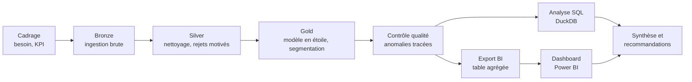

| Étape | Ce qui est fait | Pourquoi |
|---|---|---|
| 1. Cadrage | Problématique, 8 questions, définition des KPI | Ne produire que des chiffres utiles à une décision |
| 2. Ingestion (Bronze) | Chargement du fichier brut avec un schéma explicite, journal d'audit | Conserver la donnée d'origine, éviter de retraiter un fichier déjà chargé |
| 3. Nettoyage (Silver) | 6 règles de validité, dédoublonnage, calcul de la durée et de la vitesse, ajout des zones | Chaque ligne rejetée garde son **motif** : rien n'est supprimé silencieusement |
| 4. Modélisation (Gold) | Modèle en étoile : 1 table de faits, 5 dimensions (calendrier en français, jours fériés, créneaux horaires, zones) ; segmentation métier (type de course, tranche de distance) | Un modèle lisible par un outil BI et par un humain |
| 5. Contrôle qualité | 5 règles d'anomalie aux seuils justifiés par les données, table de traçabilité | Pouvoir répondre à « d'où vient ce chiffre ? » |
| 6. Analyse | 12 requêtes SQL, graphiques | Répondre aux questions Q1 à Q8 |
| 7. Restitution | Dashboard Power BI de 5 pages, synthèse, recommandations | Rendre les résultats actionnables pour la direction |

Choix méthodologiques clés :

- **Toutes les règles métier sont centralisées** dans [`src/business_rules.py`](src/business_rules.py) et couvertes par **26 tests unitaires** : une règle modifiée est automatiquement appliquée et testée partout.
- **Les seuils d'anomalie sont justifiés par les données** : par exemple, la course légitime la plus chère observée (130 miles) coûte environ 600 $, d'où un seuil d'anomalie à 1 000 $.
- **Les ratios sont toujours calculés comme un rapport de sommes** (CA total / minutes totales), jamais comme une moyenne de moyennes.
- **Table agrégée pour Power BI** : 638 000 lignes au lieu de 7,4 millions (÷ 12), sans perte d'exactitude, car seules des sommes et des comptages sont stockés.

## 5. Outils et technologies

| Outil | Usage | Pourquoi ce choix |
|---|---|---|
| **Python / PySpark** | Pipeline de nettoyage et de modélisation | Traite 7,7 M de lignes en 2 min 30 sur un ordinateur portable, et passerait à l'échelle sur un cluster sans changer le code |
| **SQL (DuckDB)** | Analyses métier | SQL directement sur les fichiers Parquet, sans installer de serveur de base de données |
| **Power BI Desktop** | Modèle en étoile, mesures DAX, dashboard | Outil de référence en entreprise pour la restitution aux décideurs |
| **pandas / matplotlib** | Graphiques de l'analyse | Visuels reproductibles, générés par script |
| **pytest** | Tests des règles métier | Garantir que les règles font ce qui est documenté |
| **Parquet** | Format de stockage | Typé, compressé, lisible par Spark, DuckDB et Power BI |
| **Git / GitHub, IntelliJ IDEA** | Versionnement, développement | Historique du projet, travail sur une branche dédiée |

## 6. Analyses réalisées

Toutes les requêtes sont dans [`sql/analyses_metier.sql`](sql/analyses_metier.sql) ; leurs résultats sont dans [`analysis/results/`](analysis/results/).

| Analyse | Technique |
|---|---|
| KPI globaux du mois | Agrégations, agrégats filtrés (`FILTER`) |
| Demande par heure et jour de semaine | Normalisation par le nombre de jours (janvier compte 5 mercredis mais 4 lundis), exclusion des jours fériés |
| Productivité par heure | Revenu par minute, vitesse moyenne comme indicateur de congestion |
| Segmentation par type de course | Parts du total avec fonctions de fenêtre (`SUM() OVER ()`) |
| Top 10 et concentration des zones | Cumul glissant (analyse de Pareto) |
| Rentabilité par tranche de distance | Revenu par minute et par mile |
| Paiement et pourboires | Taux de pourboire restreint aux paiements carte |
| Activité quotidienne et jours fériés | Série temporelle journalière |
| Qualité des données | Entonnoir de la donnée brute à la donnée analysée |

## 7. Résultats et indicateurs clés

| Courses analysées | Chiffre d'affaires | Panier moyen | Revenu par minute | Paiement carte | Pourboire (carte) |
|---|---|---|---|---|---|
| **7,44 M** | **114,8 M$** | **15,43 $** | **1,19 $** | **72 %** | **20,2 %** |

**Les aéroports : 6 % des courses, 21 % du chiffre d'affaires**, avec le meilleur revenu par minute (1,59 $ contre 1,10 $ dans Manhattan).

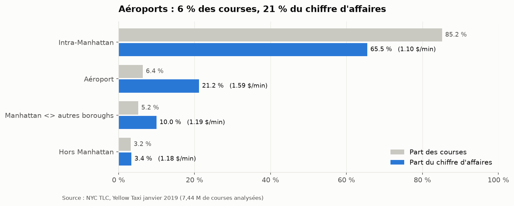

**Le pic de demande (18h) n'est pas le pic de rentabilité.** Le revenu par minute chute de 35 % entre 5h et 8h-9h, en même temps que la vitesse (23 mph puis 11 mph). L'effet persiste en ne regardant que les courses internes à Manhattan (-33 %) : c'est bien la congestion, pas un effet de mix.

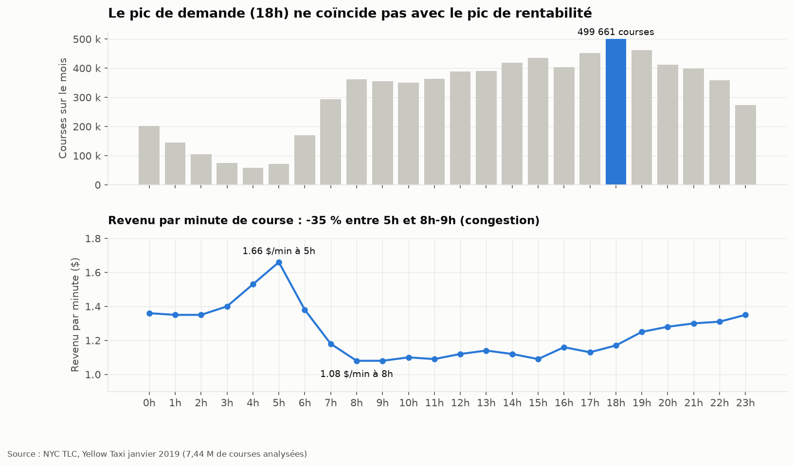

**La demande se concentre en fin de journée en semaine et la nuit le week-end.**

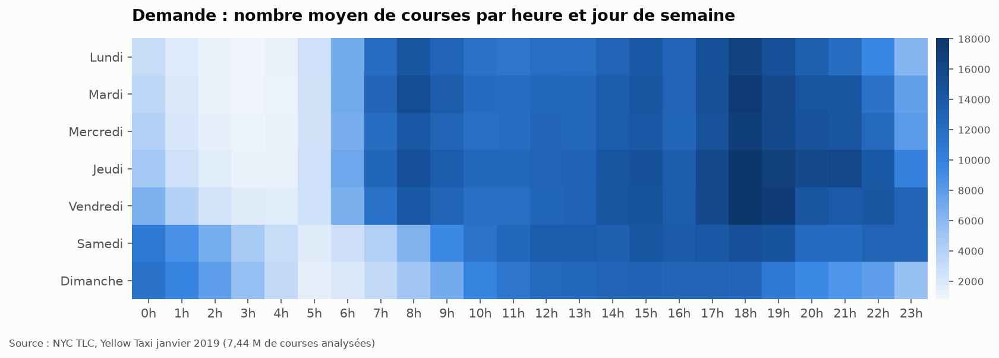

**14 zones sur 263 génèrent la moitié du chiffre d'affaires**, JFK et LaGuardia en tête (15,7 % à elles deux).

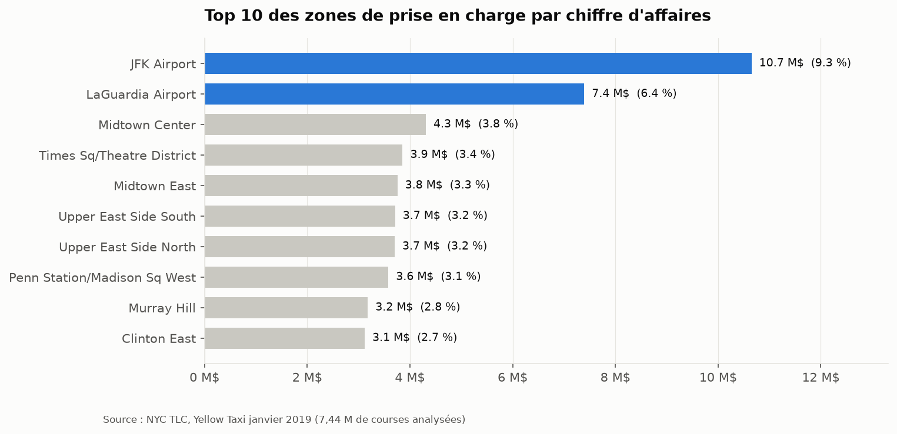

**Courbe en U de la rentabilité selon la distance** : les courses de 2 à 5 miles (un quart des courses) sont les moins rentables à la minute.

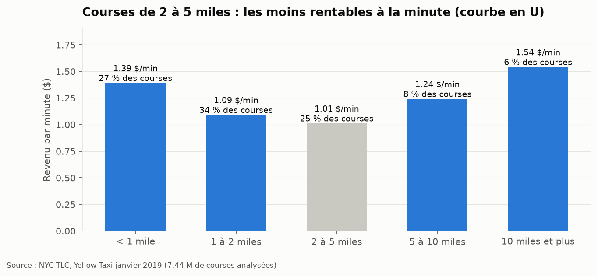

**Creux d'activité le dimanche (-21 % par rapport au vendredi) et les jours fériés (-19 % à -26 %).**

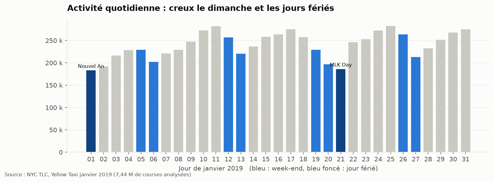

**Qualité des données** : 7 667 792 courses brutes, 177 276 rejetées par les règles métier (2,3 %),
49 704 signalées comme anomalies (0,65 %), **7 440 812 analysées (97,04 %)**. Chaque exclusion est tracée avec son motif.

Analyse détaillée question par question : [docs/04_synthese_resultats.md](docs/04_synthese_resultats.md).

## 8. Dashboard Power BI

Rapport de 5 pages destiné à la direction des opérations, construit sur le modèle en étoile avec 21 mesures DAX.

| Page | Question à laquelle elle répond |
|---|---|
| 1. Vue d'ensemble | Comment se porte l'activité ? (KPI, évolution quotidienne, poids des segments) |
| 2. Quand ? | À quelles heures renforcer la flotte ? (carte de chaleur, revenu par minute par heure) |
| 3. Où ? | Où positionner les véhicules ? (top zones, nuage de points volume / productivité) |
| 4. Rentabilité | Quelles courses sont les plus rentables ? (type, distance, pourboires) |
| 5. Qualité des données | Peut-on faire confiance aux chiffres ? (entonnoir, motifs de rejet) |

<!--
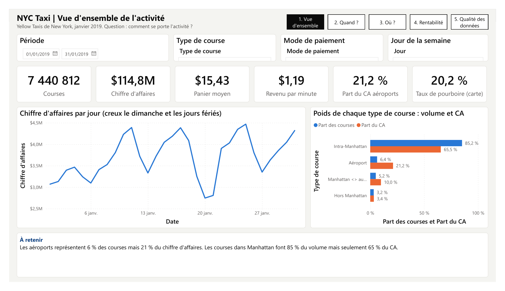
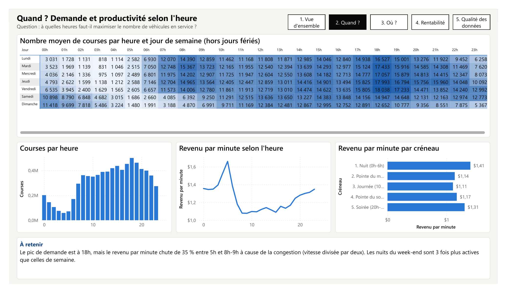
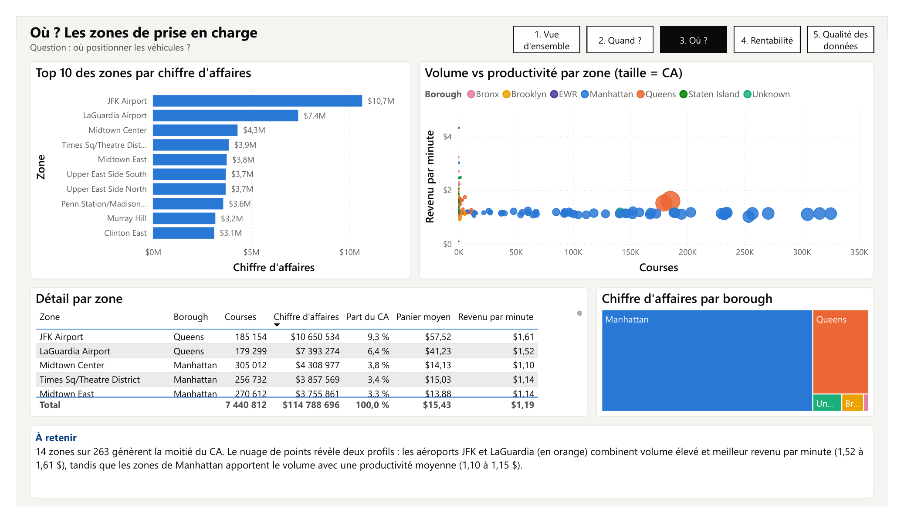
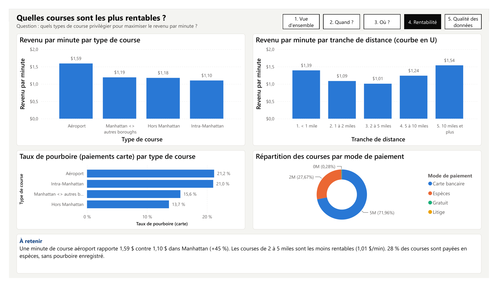
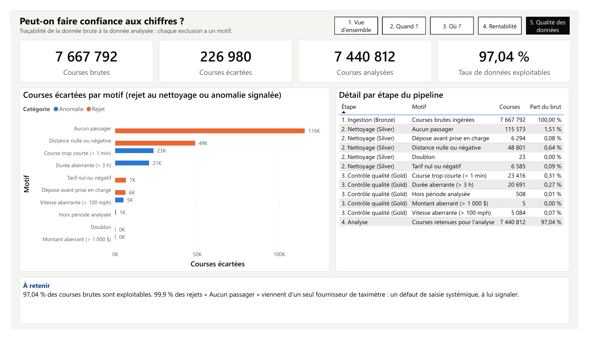
-->

Fichiers : [`powerbi/`](powerbi/) (rapport `.pbix`, export PDF, mesures DAX, thème).
Guide de construction pas à pas : [docs/03_guide_powerbi.md](docs/03_guide_powerbi.md).

## 9. Enseignements

1. **Le volume ne fait pas la rentabilité.** Les courses dans Manhattan représentent 85 % du volume mais sont les moins productives à la minute. Piloter au seul nombre de courses conduirait à de mauvaises décisions.
2. **La congestion est le premier ennemi de la productivité** : à tarif égal, une minute de course rapporte un tiers de moins aux heures de bureau qu'au petit matin.
3. **Le chiffre d'affaires est très concentré** : 5 % des zones font la moitié du CA, ce qui rend un positionnement ciblé efficace.
4. **La qualité des données est un sujet métier** : un seul fournisseur de taximètre est à l'origine de 99,9 % des rejets « aucun passager », signe d'un défaut systémique et non d'erreurs aléatoires.

## 10. Recommandations

| # | Recommandation | Appui chiffré | Priorité |
|---|---|---|---|
| 1 | Renforcer la présence aux aéroports (JFK en priorité), en suivant le temps d'attente dans la file : au-delà d'environ 17 min d'attente à JFK, une course dans Manhattan redevient plus rentable | 21 % du CA pour 6 % des courses ; 1,59 $/min | Haute |
| 2 | Aligner le planning sur la demande : maximum de véhicules de 17h à 20h en semaine et de 0h à 2h les nuits de week-end ; réduire l'offre le dimanche et les jours fériés | 18 000 courses/h au pic ; nuits du week-end x3 ; dimanche -21 % | Haute |
| 3 | Inciter aux créneaux du petit matin (4h-6h), les plus productifs | 1,66 $/min à 5h, +40 % par rapport à la moyenne | Moyenne |
| 4 | Concentrer le positionnement sur les 14 zones qui font la moitié du CA | Midtown, Upper East Side, Penn Station, Times Square | Moyenne |
| 5 | Promouvoir le paiement par carte (pourboires traçables, 20 % du tarif) | 28 % de courses en espèces sans pourboire enregistré | Moyenne |
| 6 | Signaler au fournisseur concerné le défaut de saisie du nombre de passagers | 115 000 courses rejetées | Basse |
| 7 | Mesurer l'impact de la surtaxe de congestion de février 2019 en relançant le pipeline sur les mois suivants | Janvier 2019 = référence | Basse |

## 11. Limites

- **Un seul mois** (janvier, en hiver) : pas de saisonnalité annuelle, les conclusions sont à confirmer sur d'autres mois.
- **Temps à vide non mesuré** : le revenu par minute ne compte que le temps passé avec un client. L'attente aux aéroports et la recherche de clients ne figurent pas dans les données publiques (aucun identifiant de véhicule).
- **Revenu et non marge** : sans données de coûts (carburant, location de licence, commissions), l'analyse porte sur le chiffre d'affaires, pas sur la rentabilité nette.
- **Pourboires en espèces absents** : le revenu des chauffeurs est sous-estimé pour 28 % des courses.
- **Hypothèse prudente sur les rejets** : les 115 573 courses « sans passager » sont probablement réelles (défaut de saisie). Les exclure sous-estime le CA d'environ 1,5 %, mais évite d'intégrer des données non fiables.
- **Granularité géographique** : 265 zones, pas de coordonnées GPS.
- **Compagnie fictive** : les données couvrent l'ensemble des taxis jaunes de New York, pas une flotte particulière.

## 12. Pistes d'amélioration

- Étendre l'analyse à **plusieurs années** (saisonnalité, impact de la surtaxe de congestion, effet du COVID en 2020).
- Intégrer les données **VTC (Uber, Lyft)** publiées par la TLC pour mesurer les parts de marché par zone.
- Croiser avec la **météo** (données NOAA) pour expliquer les variations de demande.
- Construire un **modèle de prévision de la demande** par zone et par heure.
- Publier le rapport sur **Power BI Service** avec actualisation planifiée, et ajouter une carte des zones (visuel *Shape Map*).
- Industrialiser le pipeline : orchestration (Airflow), conteneurisation (Docker).

## 13. Compétences démontrées

| Domaine | Compétences |
|---|---|
| Compréhension métier | Formalisation d'une problématique, choix de KPI pertinents, recommandations actionnables et priorisées |
| Préparation des données | Nettoyage de données réelles volumineuses, règles de gestion, contrôle qualité, traçabilité |
| Modélisation | Modèle en étoile, table de dates, pré-agrégation pour la BI |
| Analyse | SQL avancé (fonctions de fenêtre, agrégats filtrés, CTE), analyse de Pareto, esprit critique sur les biais (effet de mix, données manquantes) |
| Data visualisation | Dashboard Power BI orienté décision, mesures DAX, graphiques sobres et lisibles |
| Rigueur technique | Tests unitaires, code versionné, pipeline reproductible en une commande |
| Communication | Documentation claire pour un public technique et non technique |

## 14. Structure du dépôt et reproduction

```
nyc-taxi-data-engineering/
├── src/                        # Pipeline PySpark
│   ├── business_rules.py       # Règles métier centralisées (validité, segmentation, anomalies)
│   ├── bronze.py               # Ingestion + audit incrémental
│   ├── silver.py               # Nettoyage, rejets motivés, enrichissement
│   ├── gold.py                 # Modèle en étoile
│   ├── validation.py           # Contrôle qualité et table de traçabilité
│   ├── export_powerbi.py       # Tables prêtes pour Power BI
│   └── pipeline.py             # Exécution complète en une commande
├── sql/analyses_metier.sql     # 12 requêtes d'analyse
├── analysis/                   # Exécution SQL (DuckDB), graphiques, résultats CSV
├── powerbi/                    # Données Parquet, mesures DAX, thème, rapport .pbix
├── docs/                       # Cadrage, dictionnaire, guide Power BI, synthèse, graphiques
├── tests/                      # 26 tests des règles métier
└── requirements.txt
```

**Option 1 : explorer le dashboard (aucune installation technique).**
Les tables prêtes à l'emploi sont versionnées dans `powerbi/data/` : ouvrir `powerbi/nyc_taxi_dashboard.pbix`
dans Power BI Desktop, ou reconstruire le rapport avec le [guide](docs/03_guide_powerbi.md).

**Option 2 : relancer tout le pipeline** (Linux, macOS ou WSL2 sous Windows ; Java 17 ou plus requis).

```bash
pip install -r requirements.txt

# Données : mois complet (~690 Mo) et référentiel des zones
curl -L -o data/raw/yellow_tripdata_2019-01.csv.gz \
  https://github.com/DataTalksClub/nyc-tlc-data/releases/download/yellow/yellow_tripdata_2019-01.csv.gz
gunzip data/raw/yellow_tripdata_2019-01.csv.gz
curl -L -o data/raw/taxi_zone_lookup.csv \
  https://github.com/DataTalksClub/nyc-tlc-data/releases/download/misc/taxi_zone_lookup.csv

python src/pipeline.py              # Bronze, Silver, Gold, qualité, export Power BI (~3 min)
python analysis/make_charts.py      # Requêtes SQL, résultats CSV et graphiques
pytest tests/ -v                    # Tests des règles métier
```

Pour un test rapide sur un échantillon de 10 % : `python src/pipeline.py yellow_tripdata_2019-01.csv 0.1`.

---

**Cedric**, Mastère IA & Big Data, ESGI Paris
