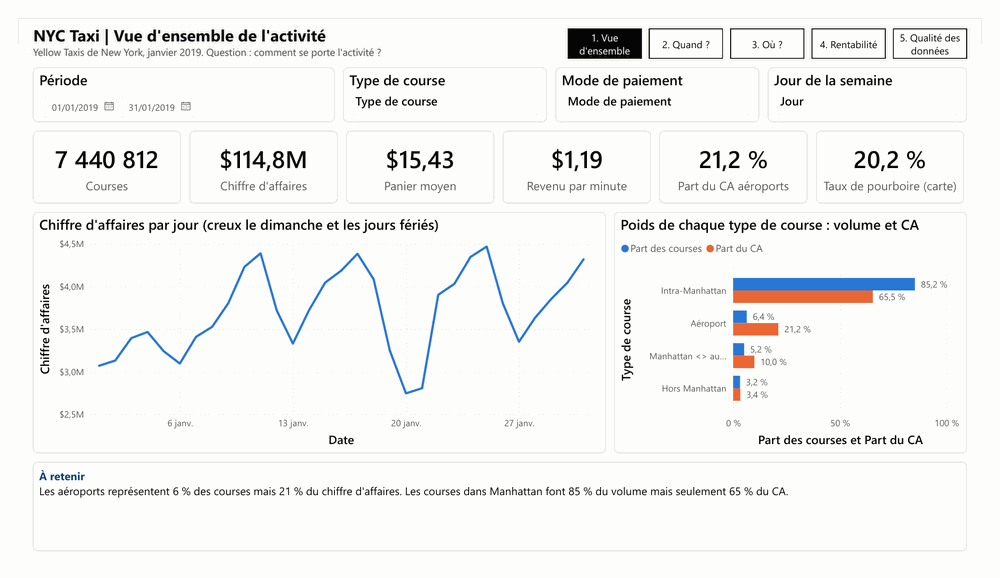
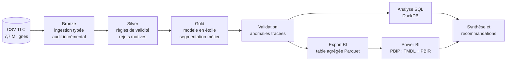
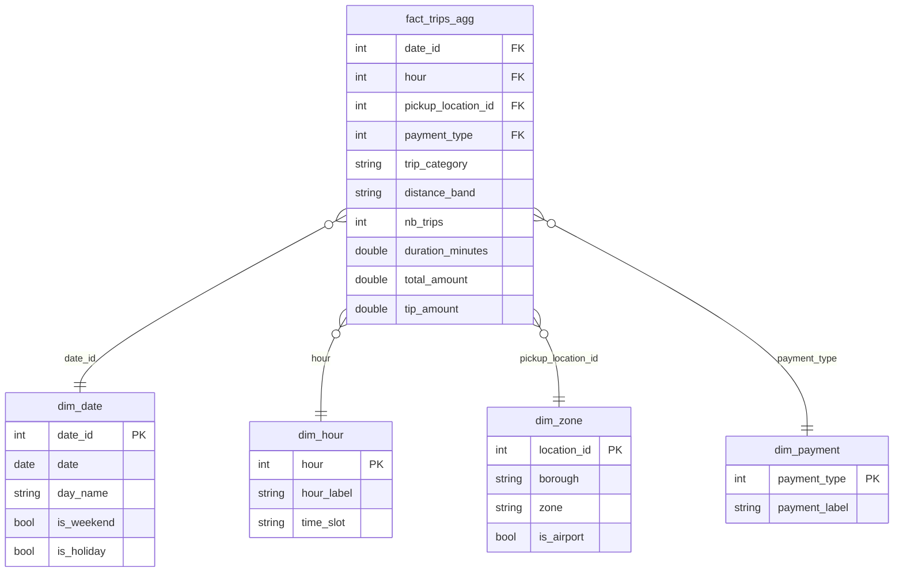

# NYC Taxi : où et quand positionner les chauffeurs pour maximiser le revenu ?


Analyse de **7,7 millions de courses réelles** de taxis jaunes new-yorkais (janvier 2019), du besoin
métier jusqu'au dashboard Power BI et aux recommandations.



| Vous êtes... | Commencez par |
|---|---|
| Recruteur, manager, profil métier | [Partie 1 : l'essentiel en 3 minutes](#partie-1--lessentiel-en-3-minutes) |
| Data Analyst, Data Engineer, profil technique | [Partie 2 : le détail technique](#partie-2--le-détail-technique) |

---

# Partie 1 : l'essentiel en 3 minutes

## Le contexte

Une compagnie de taxis jaunes à New York (entreprise fictive, **données réelles** publiées par la ville)
fait face à la concurrence d'Uber et Lyft et aux embouteillages de Manhattan. Sa direction des
opérations se pose une question simple :

> **Où et quand positionner nos chauffeurs pour qu'ils gagnent le plus possible par heure de travail ?**

## Ce que j'ai fait

| Étape | En clair |
|---|---|
| 1. Comprendre le besoin | Traduire la question de la direction en 8 questions précises et en indicateurs mesurables |
| 2. Nettoyer les données | Écarter les erreurs (courses à 623 000 $, dates de 2008, trajets de 0 km) en gardant une trace de chaque exclusion. Résultat : **97 % des données exploitables** |
| 3. Organiser les données | Les structurer pour qu'on puisse les analyser par jour, par heure, par quartier, par type de course |
| 4. Analyser | Répondre aux 8 questions avec des requêtes chiffrées |
| 5. Restituer | Un **dashboard Power BI de 5 pages** et des **recommandations** priorisées |

**L'indicateur clé : le revenu par minute.** Une course vers l'aéroport rapporte 51 $ mais dure 32 minutes ;
une course dans Manhattan rapporte 12 $ en 11 minutes. Pour un chauffeur, la ressource rare est le temps :
c'est donc ce qu'une minute de course rapporte qui permet de comparer des courses très différentes.

## Ce que révèlent les données

**1. Les aéroports sont la meilleure opportunité.** Ils représentent 6 % des courses mais **21 % du chiffre
d'affaires**, et une minute de course y rapporte 45 % de plus que dans Manhattan.


**2. Les embouteillages coûtent cher.** Entre 5h et 9h du matin, ce que rapporte une minute de course chute
de **35 %** : la ville est bouchée, les courses s'allongent mais le prix ne suit pas. Et l'heure où il y a le
plus de clients (18h) n'est pas l'heure la plus rentable.


**3. Le chiffre d'affaires est très concentré.** 14 quartiers sur 263 génèrent la moitié du chiffre d'affaires.

**4. Les données ont leurs propres problèmes.** Un seul fabricant de taximètre est responsable de 99,9 % des
courses enregistrées « sans passager » : un défaut de saisie à lui signaler.

## Mes recommandations

| Priorité | Recommandation | Pourquoi |
|---|---|---|
| Haute | Renforcer la présence aux aéroports, en surveillant l'attente dans la file (au-delà de 17 min à JFK, Manhattan redevient plus rentable) | 21 % du CA pour 6 % des courses |
| Haute | Adapter le planning : un maximum de chauffeurs de 17h à 20h en semaine et la nuit le week-end, moins le dimanche et les jours fériés | Pic de 18 000 courses par heure ; dimanche -21 % |
| Moyenne | Encourager les créneaux du petit matin (4h-6h), les plus rentables | Une minute y rapporte 40 % de plus que la moyenne |
| Moyenne | Concentrer les chauffeurs sur les 14 quartiers qui font la moitié du CA | Midtown, Upper East Side, Penn Station, Times Square |
| Moyenne | Promouvoir le paiement par carte | Les pourboires en espèces (28 % des courses) ne sont pas enregistrés |

## Le dashboard

Cinq pages, chacune répondant à une question, avec un encadré « À retenir » qui donne la conclusion.


<details>
<summary><b>Voir les 4 autres pages</b> (Quand ? Où ? Rentabilité, Qualité des données)</summary>

**Quand ?** À quelles heures renforcer la flotte ?


**Où ?** Où positionner les véhicules ?


**Rentabilité** : quelles courses privilégier ?


**Qualité des données** : peut-on faire confiance aux chiffres ?


</details>

Le rapport est consultable sans installer Power BI : [version PDF](powerbi/NYC_Taxi_Dashboard.pdf).

## Ce que ce projet démontre

- **Sens métier** : partir d'une question de direction, choisir les bons indicateurs, conclure par des recommandations chiffrées.
- **Rigueur** : chaque donnée écartée est justifiée, chaque chiffre du dashboard est recoupé avec une seconde source.
- **Technique** : traitement de gros volumes (Python, PySpark), SQL, modélisation, Power BI et DAX.
- **Communication** : des résultats compréhensibles par un public non technique.

## Les limites, en toute transparence

Un seul mois analysé (janvier) ; le temps passé à chercher un client ou à attendre à l'aéroport n'est pas dans
les données ; on mesure le chiffre d'affaires, pas le bénéfice (aucune donnée de coûts). Détail en [partie 2](#limites).

---

# Partie 2 : le détail technique

## Sommaire

1. [Architecture](#architecture)
2. [Stack et choix techniques](#stack-et-choix-techniques)
3. [Données et qualité](#données-et-qualité)
4. [Pipeline de données](#pipeline-de-données)
5. [Modèle en étoile](#modèle-en-étoile)
6. [Analyses SQL](#analyses-sql)
7. [Power BI : modèle sémantique et BI as code](#power-bi--modèle-sémantique-et-bi-as-code)
8. [Tests et validation](#tests-et-validation)
9. [Structure du dépôt](#structure-du-dépôt)
10. [Reproduire le projet](#reproduire-le-projet)
11. [Limites](#limites)
12. [Pistes d'amélioration](#pistes-damélioration)
13. [Documentation](#documentation)

## Architecture

Architecture **médaillon** (Bronze, Silver, Gold), suivie d'une couche d'analyse et d'une couche de restitution.



## Stack et choix techniques

| Outil | Usage | Pourquoi ce choix |
|---|---|---|
| **PySpark 4** | Pipeline Bronze, Silver, Gold | 7,7 M de lignes traitées en 2 min 30 en local ; le même code passe à l'échelle sur un cluster |
| **DuckDB** | Analyses SQL | SQL analytique directement sur les fichiers Parquet, sans serveur |
| **Parquet** | Stockage de toutes les couches | Typé, compressé, lu nativement par Spark, DuckDB et Power BI (pas de problème de séparateur décimal entre locale US et FR) |
| **Power BI Desktop** | Modèle sémantique, DAX, dashboard | Standard de la restitution en entreprise |
| **Format PBIP (TMDL, PBIR)** | Rapport versionné sous forme de fichiers texte | Diff lisibles dans Git, génération et validation par script |
| **pandas, matplotlib** | Graphiques d'analyse | Visuels reproductibles |
| **pytest** | Tests des règles métier | Les règles documentées sont celles exécutées |

## Données et qualité

| Source | Volume |
|---|---|
| [NYC TLC Yellow Taxi Trip Records](https://www.nyc.gov/site/tlc/about/tlc-trip-record-data.page), janvier 2019 | 7 667 792 courses, 18 colonnes, 690 Mo |
| Taxi Zone Lookup (TLC) | 265 zones |

**Entonnoir de qualité** (table `data_quality`, visible en page 5 du dashboard) :

| Étape | Motif | Courses | % du brut |
|---|---|---:|---:|
| Bronze | Courses brutes ingérées | 7 667 792 | 100,00 % |
| Silver (rejet) | Aucun passager | 115 573 | 1,51 % |
| Silver (rejet) | Distance nulle ou négative | 48 801 | 0,64 % |
| Silver (rejet) | Tarif nul ou négatif | 6 585 | 0,09 % |
| Silver (rejet) | Dépose avant prise en charge | 6 294 | 0,08 % |
| Silver (rejet) | Doublon | 23 | 0,00 % |
| Gold (anomalie) | Course trop courte (< 1 min) | 23 416 | 0,31 % |
| Gold (anomalie) | Durée aberrante (> 3 h) | 20 691 | 0,27 % |
| Gold (anomalie) | Vitesse aberrante (> 100 mph) | 5 084 | 0,07 % |
| Gold (anomalie) | Hors période analysée | 508 | 0,01 % |
| Gold (anomalie) | Montant aberrant (> 1 000 $) | 5 | 0,00 % |
| **Analyse** | **Courses retenues** | **7 440 812** | **97,04 %** |

Les **seuils d'anomalie sont tirés des données**, pas choisis arbitrairement : la course légitime la plus chère
observée (131 miles) coûte 614 $, d'où un seuil à 1 000 $ qui n'écarte que 5 erreurs manifestes (dont une à 623 261 $ pour 2,4 miles).

Dictionnaire complet et règles de gestion : [docs/02_dictionnaire_donnees.md](docs/02_dictionnaire_donnees.md).

## Pipeline de données

| Couche | Script | Rôle | Décisions techniques |
|---|---|---|---|
| Bronze | [`bronze.py`](src/bronze.py) | Ingestion avec schéma explicite, partitionnement année/mois | **Audit incrémental** : un fichier déjà chargé avec succès est ignoré. **Fail-fast** : un échec stoppe la chaîne |
| Silver | [`silver.py`](src/silver.py) | Validité, dédoublonnage, durée, vitesse, zones | **Rejets motivés** (`reject_reason`) écrits dans `silver/rejected`, jamais supprimés. **Broadcast join** sur les 265 zones pour éviter un shuffle |
| Gold | [`gold.py`](src/gold.py) | Modèle en étoile | Calendrier complet en français avec jours fériés, créneaux horaires, segmentation (type de course, tranche de distance), colonne `anomaly_reason` |
| Qualité | [`validation.py`](src/validation.py) | Table `data_quality` | Traçabilité de chaque exclusion, du brut à l'analyse |
| Export BI | [`export_powerbi.py`](src/export_powerbi.py) | Table agrégée pour Power BI | 638 473 lignes au lieu de 7,4 M (÷ 12), **sans perte d'exactitude** : uniquement des sommes et comptages, ratios recalculés en DAX |
| Orchestration | [`pipeline.py`](src/pipeline.py) | Exécution complète | Une commande, environ 3 minutes |

**Règles métier centralisées** dans [`src/business_rules.py`](src/business_rules.py) : validité, segmentation et
anomalies sont définies une seule fois, importées par le pipeline et par les tests.

## Modèle en étoile



Grain de la table de faits : **jour × heure × zone de départ × mode de paiement × type de course × tranche de distance**.

## Analyses SQL

12 requêtes dans [`sql/analyses_metier.sql`](sql/analyses_metier.sql), exécutées par DuckDB sur les Parquet Gold ;
résultats versionnés dans [`analysis/results/`](analysis/results/).

| Question | Technique SQL | Résultat clé |
|---|---|---|
| Demande par heure et jour | Normalisation par le nombre de jours (5 mercredis mais 4 lundis en janvier), exclusion des jours fériés | Pic à 18h, environ 18 000 courses/h jeudi et vendredi |
| Productivité horaire | Revenu par minute = `SUM(total) / SUM(durée)` | 1,66 $/min à 5h, 1,08 $ à 8h-9h |
| Effet de mix ou congestion ? | Même calcul restreint à l'intra-Manhattan | -33 % : c'est bien la congestion |
| Poids des segments | Fonctions de fenêtre `SUM() OVER ()` | Aéroports : 6,4 % des courses, 21,2 % du CA |
| Concentration géographique | Cumul glissant, analyse de Pareto (CTE) | 14 zones = 50 % du CA, 32 zones = 80 % |
| Rentabilité par distance | Revenu par minute et par mile | Courbe en U, minimum à 2-5 miles (1,01 $/min) |
| Pourboires | Agrégats filtrés (`FILTER`), carte uniquement | 20,2 % du tarif |
| Qualité | Rejets par fournisseur | 99,9 % des « aucun passager » chez un seul fournisseur |

<details>
<summary><b>Voir les autres graphiques d'analyse</b></summary>


</details>

Synthèse complète question par question : [docs/04_synthese_resultats.md](docs/04_synthese_resultats.md).

## Power BI : modèle sémantique et BI as code

- **Modèle** : 7 tables, 4 relations plusieurs-à-un à filtrage unidirectionnel, `dim_date` marquée comme table de dates,
  colonnes renommées en français et triées (lundi à dimanche, 0h à 23h), clés techniques masquées,
  mesures implicites désactivées, paramètre `DossierDonnees` pour le chemin des fichiers.
- **26 mesures DAX** rangées en dossiers ([`powerbi/mesures_dax.dax`](powerbi/mesures_dax.dax)). Exemples :

```dax
Revenu par minute = DIVIDE ( [Chiffre d'affaires], [Minutes de course] )

Part du CA = DIVIDE ( [Chiffre d'affaires], CALCULATE ( [Chiffre d'affaires], ALLSELECTED () ) )

CA top 10 zones =
VAR _rang = RANKX ( ALLSELECTED ( dim_zone[Zone] ), [Chiffre d'affaires] )
RETURN IF ( _rang <= 10, [Chiffre d'affaires] )
```

- **BI as code** : le rapport est livré au format **PBIP** (modèle en TMDL, rapport en PBIR), c'est-à-dire en
  fichiers texte versionnés, entièrement générés par [`powerbi/generer_pbip.py`](powerbi/generer_pbip.py).
- **Livrables** : projet [`NYC_Taxi_Dashboard.pbip`](powerbi/NYC_Taxi_Dashboard.pbip),
  fichier [`NYC_Taxi_Dashboard.pbix`](powerbi/NYC_Taxi_Dashboard.pbix) (données embarquées),
  export [PDF](powerbi/NYC_Taxi_Dashboard.pdf), [thème](powerbi/theme_nyc_taxi.json).

Guide d'ouverture et de compréhension du modèle : [docs/03_guide_powerbi.md](docs/03_guide_powerbi.md).

## Tests et validation

| Contrôle | Outil | Résultat |
|---|---|---|
| Règles métier (validité, segmentation, anomalies, créneaux) | pytest, [`tests/`](tests/) | 26 tests passés |
| Modèle sémantique | Tabular Object Model (bibliothèque officielle Microsoft) | 7 tables, 4 relations, 26 mesures, références DAX résolues |
| Fichiers du rapport | Schémas JSON officiels Microsoft (ajv) | 58 fichiers conformes |
| Recette des KPI | Comparaison Power BI et SQL | Valeurs identiques (7 440 812 courses, 114 788 696 $, 1,19 $/min) |
| Exactitude de l'agrégation | Totaux table agrégée et table détaillée | Identiques |

## Structure du dépôt

```
├── src/                        Pipeline PySpark
│   ├── business_rules.py       Règles métier centralisées
│   ├── bronze.py               Ingestion et audit incrémental
│   ├── silver.py               Nettoyage, rejets motivés, enrichissement
│   ├── gold.py                 Modèle en étoile
│   ├── validation.py           Table de traçabilité qualité
│   ├── export_powerbi.py       Tables pour Power BI
│   └── pipeline.py             Exécution complète
├── sql/analyses_metier.sql     12 requêtes d'analyse
├── analysis/                   Exécution SQL (DuckDB), graphiques, résultats CSV
├── powerbi/
│   ├── NYC_Taxi_Dashboard.pbip / .pbix / .pdf
│   ├── NYC_Taxi_Dashboard.SemanticModel/   Modèle (TMDL)
│   ├── NYC_Taxi_Dashboard.Report/          Rapport (PBIR)
│   ├── generer_pbip.py         Générateur du projet Power BI
│   ├── data/                   Tables Parquet prêtes à l'emploi
│   └── mesures_dax.dax, theme_nyc_taxi.json
├── docs/                       Cadrage, dictionnaire, guide Power BI, synthèse, images
├── tests/                      Tests des règles métier
└── requirements.txt
```

## Reproduire le projet

**Consulter le dashboard** : ouvrir [`powerbi/NYC_Taxi_Dashboard.pbix`](powerbi/NYC_Taxi_Dashboard.pbix) dans
Power BI Desktop (données incluses), ou le [PDF](powerbi/NYC_Taxi_Dashboard.pdf).

**Relancer toute la chaîne** (Linux, macOS ou WSL2 ; Java 17 ou plus) :

```bash
pip install -r requirements.txt

curl -L -o data/raw/yellow_tripdata_2019-01.csv.gz \
  https://github.com/DataTalksClub/nyc-tlc-data/releases/download/yellow/yellow_tripdata_2019-01.csv.gz
gunzip data/raw/yellow_tripdata_2019-01.csv.gz
curl -L -o data/raw/taxi_zone_lookup.csv \
  https://github.com/DataTalksClub/nyc-tlc-data/releases/download/misc/taxi_zone_lookup.csv

python src/pipeline.py              # Bronze, Silver, Gold, qualité, export Power BI (environ 3 min)
python analysis/make_charts.py      # Requêtes SQL, résultats CSV, graphiques
python powerbi/generer_pbip.py      # Régénère le projet Power BI (écrase les retouches manuelles)
pytest tests/ -v
```

Échantillon rapide (10 %) : `python src/pipeline.py yellow_tripdata_2019-01.csv 0.1`.

## Limites

- **Un seul mois** (janvier, en hiver) : pas de saisonnalité annuelle.
- **Temps à vide non mesuré** : les données publiques n'ont pas d'identifiant de véhicule, donc ni l'attente aux
  aéroports ni la recherche de clients ne sont observables. Le revenu par minute ne compte que le temps avec un client.
- **Chiffre d'affaires, pas marge** : aucune donnée de coûts (carburant, licence, commissions).
- **Pourboires en espèces absents** : revenu des chauffeurs sous-estimé pour 28 % des courses.
- **Hypothèse prudente** : les 115 573 courses « sans passager » sont probablement réelles ; les exclure sous-estime
  le CA d'environ 1,5 % mais évite d'intégrer des données non fiables.
- **Granularité** : 265 zones, pas de coordonnées GPS.
- **Compagnie fictive** : les données couvrent l'ensemble des taxis jaunes de New York.

## Pistes d'amélioration

- Étendre à plusieurs mois ou années : saisonnalité, impact de la surtaxe de congestion (février 2019), effet du COVID.
- Intégrer les données VTC (Uber, Lyft) publiées par la TLC pour mesurer les parts de marché par zone.
- Croiser avec la météo (NOAA) pour expliquer les variations de demande.
- Modèle de prévision de la demande par zone et par heure.
- Publication sur Power BI Service avec actualisation planifiée ; carte des zones (Shape Map).
- Orchestration (Airflow) et conteneurisation (Docker).

## Documentation

| Document | Contenu |
|---|---|
| [01 Cadrage métier](docs/01_cadrage_metier.md) | Contexte, problématique, parties prenantes, KPI |
| [02 Dictionnaire de données](docs/02_dictionnaire_donnees.md) | Tables, colonnes, règles de gestion |
| [03 Guide Power BI](docs/03_guide_powerbi.md) | Ouvrir, comprendre et faire évoluer le dashboard |
| [04 Synthèse des résultats](docs/04_synthese_resultats.md) | Réponses détaillées aux 8 questions, recommandations |
| [05 Checklist de finalisation](docs/05_checklist_finalisation.md) | Étapes de publication et de valorisation |

---

**Cedric**, Mastère IA & Big Data, ESGI Paris
